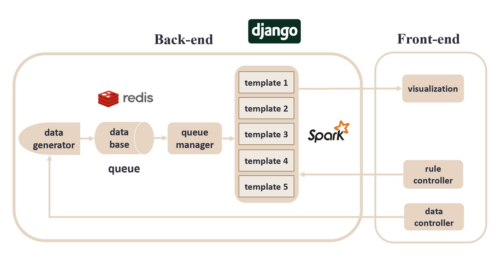
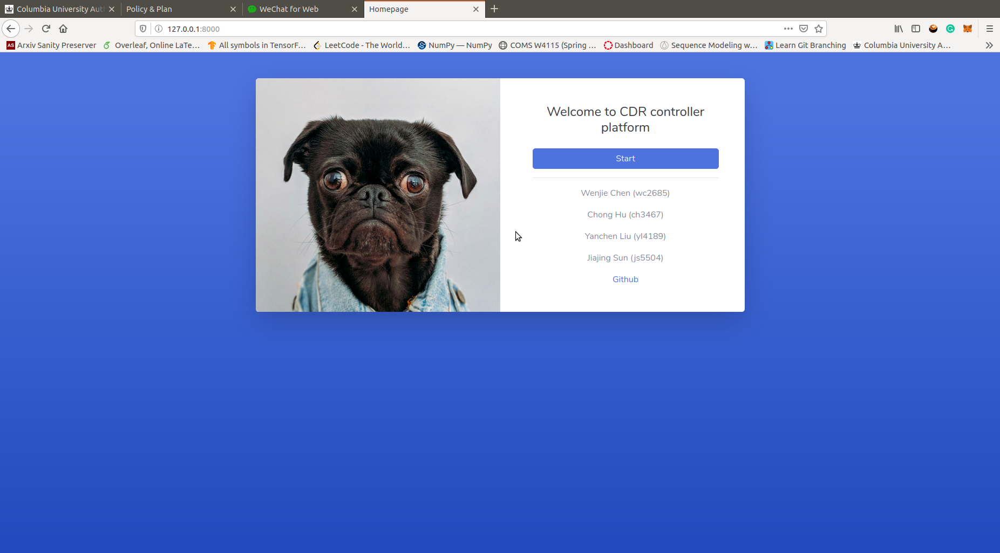
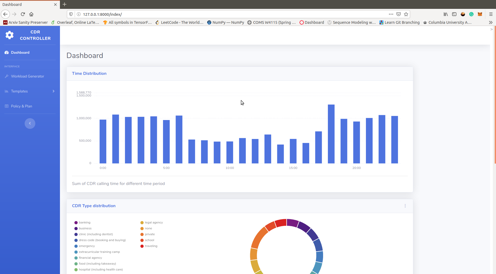
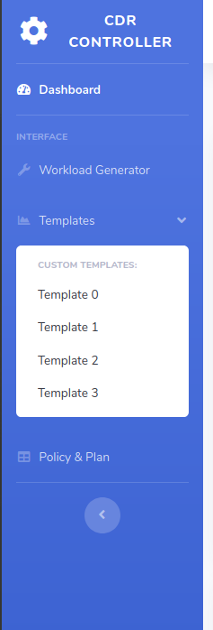
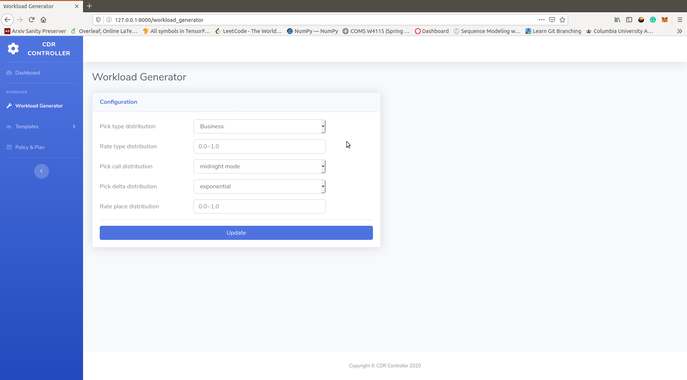
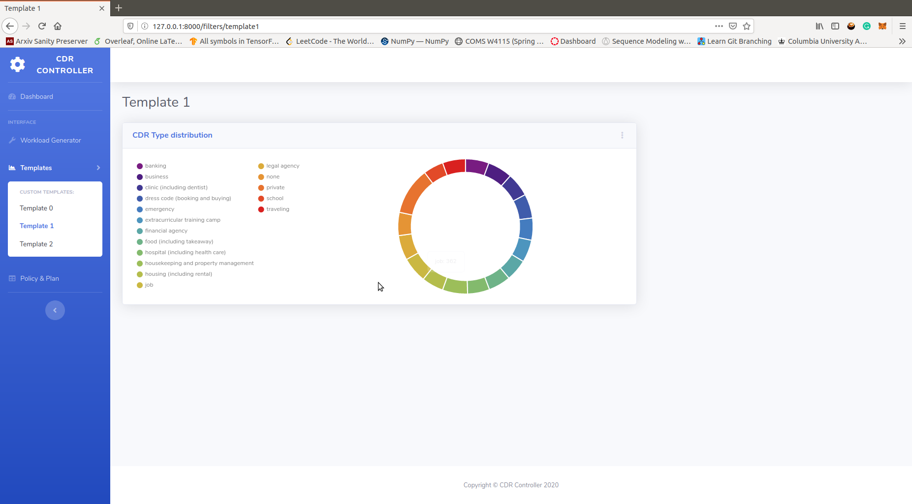
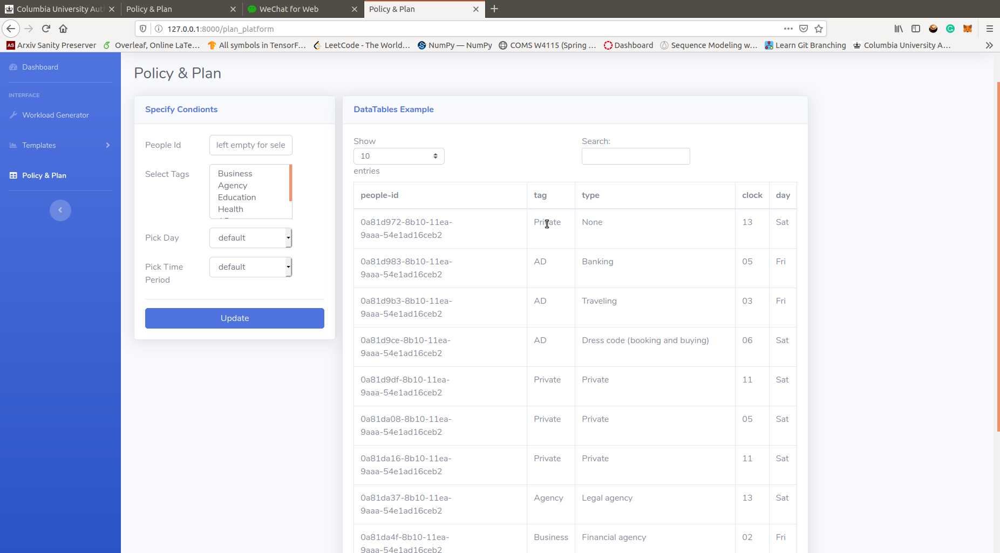

# Rule-based Marketing Platform to Manage Call Detail Record (CDR)

A toy project of markting platform to manage call by using `Spark Streaming` as stream processor, `Django` as back-end, [`SB Admin 2`](https://startbootstrap.com/themes/sb-admin-2/) as front-end template and `Redis` as Message Queue.

This is final project for ELEN E6889 Large-Scale Stream Processing @ Columbia.

## Introduction

Our project implement a rule-based marketing platform to manage Call Detail Record(CDR). We develop a Data Generator to simulate real-time CDR data. Streaming is achieved by message queue based on Redis and the queue manager, which is used to simulate subscriber mode. Five templates are developed based on Spark streaming  to analyzed the streaming data. We choose Django framework to integrate the front-end and back-end and interact with the front-end UI. The front-end UI provides visualization of our results and the control of the back-end. Optimization and streaming algorithms are implemented to improve the performance of our system. We discuss how the size of data stream would affect the CPU utilization.

## Structure

### System Architecture


See more about our system from [report](doc/large_scale_stream_processing_final_report.pdf)

### Code Structure

```bash
.
├── doc
├── pic
├── cdr_controller # -> Django back-end core
│   ├── data_generator.py # -> workload generator
│   ├── filters # -> different templates to process streams
│   │   ├── template_01.py
│   │   ├── ...
│   │   └── template_05.py
│   ├── get_result.py # -> get real-time result
│   ├── queue_manage.py # -> Django back-end core
│   ├── settings.py # -> Django setting
│   ├── urls.py # -> Django urls
│   ├── views.py # -> Django views: render HTML and data
│   └── wsgi.py # -> Django file
├── res # -> tmp result used in front-end
├── static # -> js packages used in front-end
├── templates # -> HTML files shown in front-end
├── db.sqlite3
├── manage.py # -> Django deploy file
├── LICENSE
├── CONTRIBUTING.md
└── README.md
```

## Requirements

- `Python3`: python3 environment and pip
  - `pip3 install Django`: install Django framework
  - `pip3 install uuid`: install uuid to generate uuid
  - `pip3 install redis`: install redis package in Python3
  - `pip3 install phonenumbers`: install phone number package in Python3
  - `pip3 install numpy pandas`: install numpy and pandas in Python3
  - `pip3 install pyspark`: install Spark package in Python3
- `Redis`: install `Redis`. For more details, please see [Get Started with Redis](https://redislabs.com/get-started-with-redis/)
  
   ``` bash
    sudo apt update
    sudo apt install redis-server
   ```

- `Spark`: install `Spark`, if don't want to built-in `Spark` environment provide by `pyspark`
  - For more details, please see [Spark Documentation](https://spark.apache.org/docs/latest/index.html)

## Deploy

run `Django` server on `localhost:8000`

```bash
# at root directory
python3 manage.py runserver localhost:8000
```

## Usage

- Homepage
  - First visit `localhost:8000/`, which is a welcome page.
  - press the start button to start workload generator in back-end
  
    
- Dashboard
  - After pressing the start button, web will redirect to `localhost:8000/index`.
  - The dashboard page shows extracted features of stream in real-time. 
  
    
  - You can access other componment by the sidebar.
  
    

- Workload Generator
  - Workload generator will be shown at `localhost:8000/workload_generator`
  - You can change the controlling parameters by filling the form.
  - After pressing `Update`, back-end may need several minutes to update workload generator configuration.
  
    

- Templates:
  - Each templates details can be also found at `localhost:8000/filters/template<id>`
  
    

- Policy & Plan page
  - This page is used to decide different policy and send promotion to corresponding users.
  - A table showing those users respesents the backend applys certain rules or send promotions to those users.
  - The form in the left represent some rules that can be applied.
    
     


## Details

See more details about how we design this project, how we implement each components, what algorithms we applied to optimize stream processing from [report](doc/large_scale_stream_processing_final_report.pdf)


## Documentation

* Proposal: [proposal pdf](doc/large_scale_streaming_proj_proposal.pdf)
* Report: [report pdf](doc/large_scale_stream_processing_final_report.pdf)
* Presentation: [presetation slides](doc/large_scale_streaming_proj_final_presentation.pdf)

## Contribution

- Workload Generator: Wenjie Chen, Yanchen Liu
- Queue Manager: Yanchen Liu, Chong Hu
- Templates: Wenjie Chen, Chong Hu
- Django back-end construction: Chong Hu, Yanchen Liu
- Front-end: Chong Hu
- Documentation:  Wenjie Chen, Chong Hu, Jiajing Su, Yanchen Liu

## Acknowledgements

First, we would like to thank Professor Deepak S. Turaga. Without you, we can never finish our final project from scratch. Thank you for the instructions and help of a whole semester! 

Second, we would like to thank all the authors and the contributors of our reference material. They have done a great work before us.

## License

Copyright (c) 2020. All rights reserved.

The code is distributed under a MIT license. See [`LICENSE`](LICENSE) for information.


## Contact

- Chong Hu `ch3467`: [email](mailto:ch3467@columbia.edu)
- Wenjie Chen `wc2685`: [email](mailto:wc2685@columbia.edu)
- Yanchen Liu `yl4189`: [email](mailto:yl4189@columbia.edu)
- Jiajing Sun `js5504`:[email](mailto:js5504@columbia.edu)